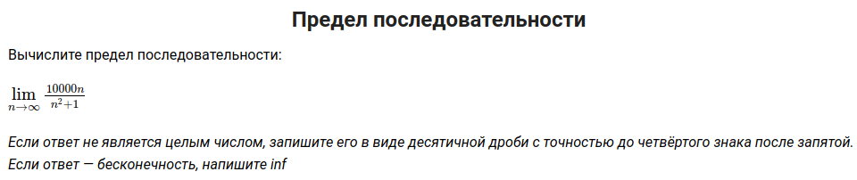

# Примеры

## Пример № 1

<kbd></kbd>

```text
limit((10000*n)/(n^2+1)) as n->infinity
```

[compute](https://www.wolframalpha.com/input/?i=limit((10000*n)%2F(n%5E2%2B1))+as+n->infinity)

# Ссылки

- [Wolfram|Alpha Examples: Limits](https://www.wolframalpha.com/examples/math/calculus/limits/)
