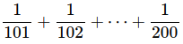

# Примеры

## Пример № 1

<kbd></kbd>

```text
sum 1/(100+i), i=1 to 100
```

[compute](https://www.wolframalpha.com/input/?i=sum+1%2F(100%2Bi),+i%3D1+to+100)

# Ссылки

- [Wolfram|Alpha Examples: Sums](https://www.wolframalpha.com/examples/math/calculus/sums/)
